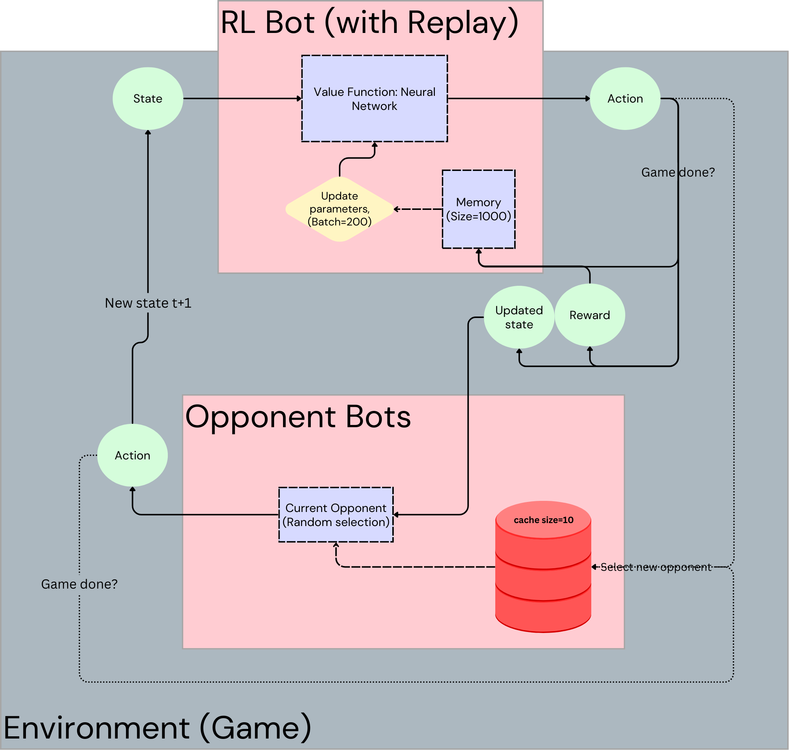

# Self-Play Training

This document outlines our method for improving our self-play regiment for the Reinforcement Learning (RL) bot.

# What is Self-play?
Self-play is a method for RL bots to learn a task by playing against itself.
Bots learn by trial-and-error in this method without us having to supervise/instruct it on what is right or wrong. 
Our responsibility is to set up the 'curriculum' for how the bot performs self-play.

In our current implementation, we have very basic 'self-play' where our RL bot is playing against itself while learning from both sides of the board (i.e., both players are performing training loops and updating parameters).

However, we update our curriculum for the bot as follows:
- RL Agent starts training loop against a random bot (1000 games). 
- Once min. loss threshold is reached (i.e., early stopping), stop training.
- Store current RL bot's parameters in opponent 'cache' if win rate for current bot is > some threshold (e.g., 55%).
- Start new training loop, and for each game (out of 1000 games), randomly select opponent to play against from opponent cache. 
    - Opponent is set to 'test/eval' mode and does not update parameters.
    - Opponent also uses pure exploitation, no exploration (i.e., epsilon==0)
- Repeat for 'n' number of rounds.

We set the training parameters for self-play as follows:
- num_levels: 50
- games per level: 1000 (early stopping enabled)
- opponent_cache size: 10
- threshold win rate: 55%

# Setup Diagram


# Implementation
Below is a snapshot into the relevant code changes for improved self-play:

## Training Loop
```python
def train_loop(...):
    """Implements cascading level self-play for RLbotDDQN"""
    n_levels = 200
    games_per_level = 1000
    players = ['RLbotDDQN', 'bot'] # starting pair
    opp_cache = deque(maxlen=10)
    for n in range(n_levels):
        curr_player = copy.deepcopy(players[0])
        players, win_rate = main(
            p1=players[0],
            p2=players[1],
            epochs=games_per_level,
            opp_cache=opp_cache,
            self_play=True
            )
        if win_rate>0.55:
            opp_cache.append(players[1])
        else:
            players = [curr_player.reset_self_play(turn=-1), copy.deepcopy(curr_player.reset_self_play(turn=1))]
```

## Within the main() game loop:
```python
def main(..., opp_cache):
    ...
    if self_play:
        players = {-1: p1, 1: p2} # RL bot to be trained on self-play is always '-1'

    # game loop: run 1 game of Connect 4 against a randomly selected opponent from cache
    while True:
        ...
        if game is done: # win or draw is reached
            players[1] = random.sample(opp_cache, 1)[0]
    
    # When training level is done with 1000 games (or early stopped)
    out_players = [
        players[-1].reset_self_play(turn=-1),
        copy.deepcopy(players[-1]).reset_self_play(turn=1)
        ]
    return out_players, WIN_RATES[-1]
```

# Reset the bot after every self-play training level
```python
class RLBotDDQN(RLBot):
    ...
    def reset_self_play(self, turn: int):
        self.lr = 1e-3
        self.epsilon = 0.3
        self.losses = []
        self.rewards = []
        self.n_moves = 0
        self.n_epoch_moves = 0
        self.current_sqars = [None, None, None, None, None]
        self.turn = turn

        self.memory = deque(maxlen=1000)

        self.stop_training = False
        self.min_loss_dict = {'current_min': np.inf, 'num_steps': 0}

        self.model.eval()
        self.target_model.load_state_dict(self.model.state_dict())
        self.target_model.eval()
        return self
```