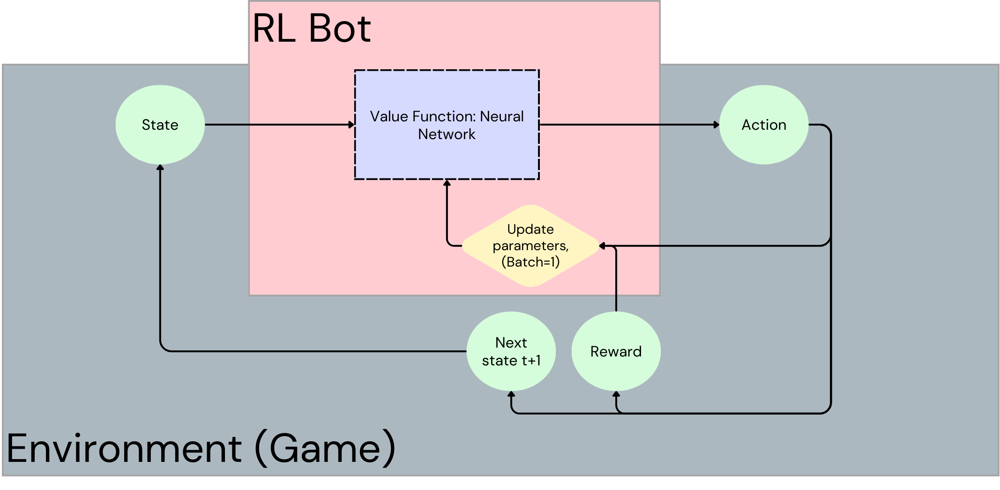
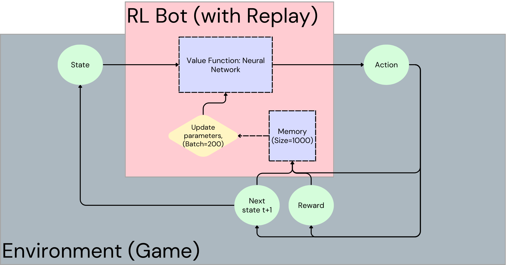
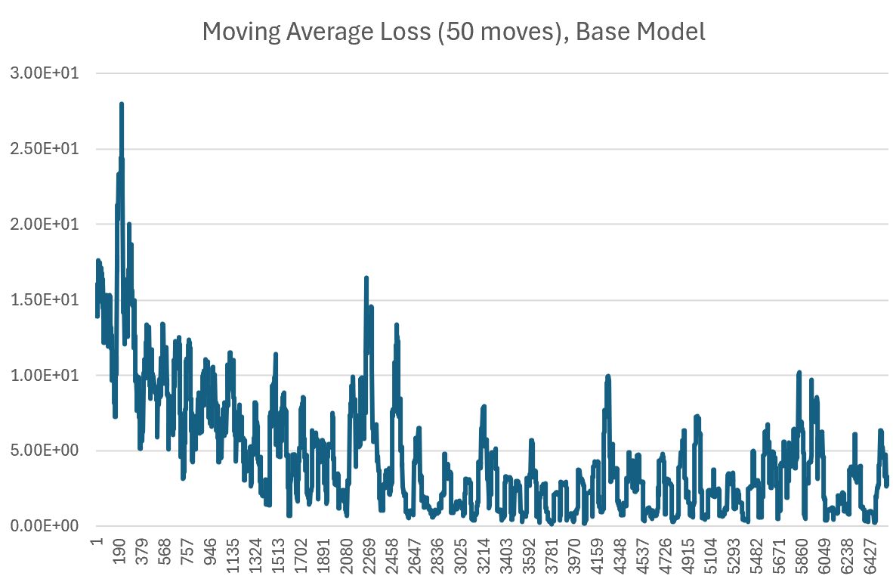
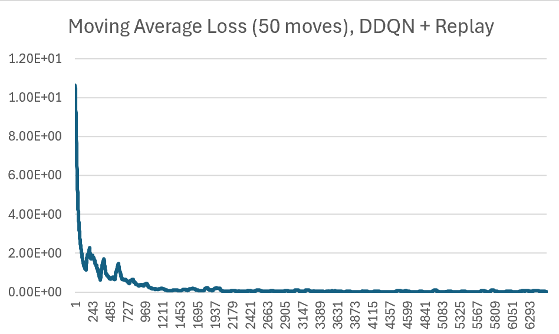

# Model Tuning & Self-Play Training

This document outlines methods for improving our RL bot with the following additions:
- Experience Replay
- Double Deep Q Network (DDQN)
- Other training adjustments


# RL Adjustments
## Experience Replay
Experience replay is a method used for stabilizing the learning that occurs in RL agents. Below, we build the intuition and motivation for using experience replay:

### Instability, Catastrophic Forgetting
In our base implementation, we train the neural network value function after every move of the board which can present issues.
Most notably, training is unstable using this form of 'online' training, especially with batch sizes of 1.
In essence, our model is being too 'sensitive' in reaction to single moves, and we would like our model to learn from a larger number of samples to help smoothen this effect.

Our models can also 'forget' what it learns as a result of placing too much importance into a single instance/move.

> Intuition: For example, imagine a game of chess where an RL bot makes a move 'Bishop to B4' which results in a win.
> 
> In a future game where a similar (but slightly different) state situation presents itself, the agent might make the same move 'Bishop to B4', but this time, ends in a loss.
> As a result, an agent that takes only the last move in consideration for training would get really confused at this because 'Bishop to B4' should've been a good move (that's why we made the move!), so it updates it's value estimation to be of much lower value for this move because that's what it just experienced.
> 
> This would lead to oscillations in its understanding of these moves which, in short, makes the agent somewhat short-sighted in its understanding of the task we're trying to teach. 

To remedy this, we store memory to generate larger batches for training to smoothen out our parameter updates.

### Reusability, Revisiting Old Experiences
Incorporating memory also enables reusability of past experience to continue training the model (almost like reviewing your notes or textbooks after a lecture in school!).
Similar to studying materials for school after a lecture, experience replay has the benefit of enabling the model to learn new things about the same experiences.
When we re-read our notes from a past lecture in school, sometimes the simple repetition can allow us to see things in a new light and make new connections about the subject matter.
Additionally, in the time that we spend away from some subject, we could have picked up other learnings that can help us 'connect the dots' when we do revisit past materials/notes that may have been confusing before.
An RL agent that learns from a set of experiences and moves on to future experiences to update their parameters (and their understanding of the task at hand) can come back to past experiences in memory to learn new things about them. 

Below is a graph of the RL bot setup before and after implementation of experience replay.
Before training the model, we store the state, action, reward, and next state in the agent's memory, sample 'n' experiences (e.g., 200), then use that batch of instances to update the neural network.

RL Bot setup BEFORE experience replay:


RL Bot setup AFTER experience replay:


Below is the implementation in the RL bot class:

```python
class RLBotDDQN(RLBot):
    def __init__(self, name: str, turn: int, test: bool) -> None:
        super().__init__(name, turn, test)
        self.memory = deque(maxlen=1000)
        self.batch_size = 200
        ...

    def train(self, new_piece_arrays, result):
        new_state = self.get_state_array(new_piece_arrays)
        new_state = self.process_state(new_state)

        reward = self.get_reward(result)
        # we store the current state, action, reward, and next state combination in 'self.current_sqars'
        curr_experience = (
            self.current_sqars[0], # state t
            self.current_sqars[2], # action t
            self.current_sqars[3], # reward t
            self.current_sqars[4], # state t+1
            int(result is not None) # flag if game ended
        )
        self.memory.append(curr_experience)

        if len(self.memory) <= self.batch_size:
            # don't train if not enough memory
            return None

        # Split out each element of the experience
        minibatch = random.sample(self.memory, self.batch_size)
        s_batch = torch.cat([s for (s,a,r,s2,d) in minibatch]).to(device)
        a_batch = torch.Tensor([a for (s,a,r,s2,d) in minibatch]).to(device)
        r_batch = torch.Tensor([r for (s,a,r,s2,d) in minibatch]).to(device)
        s2_batch = torch.cat([s2 for (s,a,r,s2,d) in minibatch]).to(device)
        d_batch = torch.Tensor([d for (s,a,r,s2,d) in minibatch]).to(device)

        q1 = self.model(s_batch)
        # get Q values of new state to update last state's Q values
        with torch.no_grad():
            new_q = self.model(s2_batch)
        max_q = torch.max(new_q, dim=1)

        # target value
        Y = r_batch + self.gamma*((1-d_batch)*max_q[0])
        X = q1.gather(dim=1, index=a_batch.long().unsqueeze(dim=1)).squeeze()

        ...

```

## Double Deep Q-Network (DDQN)
To tackle the instability of learning in our bot, we also employ a Double Deep Q-Network (DDQN) setup.
On a conceptual level, every state of the environment should be associated to some static value (assuming that we know what the 'true' value is for each state).
With online training (training while playing the game instead of just after 'n' games), every training + update iteration causes our estimates of the state values to change since we're constantly updating parameters, effectively becoming a 'moving target'. 

Consider the original Q-Learning equation below:


When we update our estimate of the current state's value $Q(s,a)$ by incorporating the predicted next state value $max Q(s',a')$, we are essentially 'learning estimates using other estimates'.
If we are using the same neural network value function to provide these estimates, this entanglement creates a constantly moving target for the model to learn, giving rise to instability.

There needs to be a smoothing effect because significant learnings don't happen from single instances, they happen over several games and incrementally over time.

To remedy this, DDQN networks use a separate 'target' network to estimate the value $max Q(s',a')$.
This target network starts as an exact copy of the original neural network value function model, but does not update itself during every training iteration like the value network does.
Instead, it stays static (does not update parameters) for some defined number of timesteps 'n' (this is a hyerparameter that we can experiment with). 
After 'n' timesteps or moves, the target network's parameters are synced with the value network's to bring it up to speed with current state value estimates.
In essence, the target network is just a lagging version of the original value network.

> Intuition: imagine you're trying to improve at chess.
> Employing a similar learning strategy like DDQNs could mean that you do the following to improve your skills:
> 
> 1. Play several matches (maybe 10? maybe 50?)
> 2. Review all matches together to distill and consolidate key learnings from the matches: What are key things you're doing wrong? What are you doing right?
> 3. Update your strategy by noting down the specific things you need to work on moving forward.
> 4. Play more games, repeat the cycle.
> 
> A non-DDQN strategy might involve you analyzing games right after each one and then changing strategy after every game based on your findings.
> Intuitively, this learning would be quite sporadic/chaotic.


Implementing a DDQN is very straight-forward as only a few lines of code need to be added:

```python
class RLBotDDQN(RLBot):
    def __init__(self, name: str, turn: int, test: bool) -> None:
        super().__init__(name, turn, test)
        
        ...

        self.target_sync_freq = 200 # how often to sync the target network to value network
        self.target_model = copy.deepcopy(self.model)
        self.target_model.load_state_dict(self.model.state_dict())

    def train(self, new_piece_arrays, result):
        # get new state array
        # get reward
        # store experience in memory
        # sample the minibatch from memory for training
        ...

        # get Q-values for current state using VALUE network
        q1 = self.model(s_batch)
        # get Q-values of new state using TARGET network
        with torch.no_grad():
            new_q = self.target_model(s2_batch)
        max_q = torch.max(new_q, dim=1)

        # calculate target value for model update
        Y = r_batch + self.gamma*((1-d_batch)*max_q[0])
        X = q1.gather(dim=1, index=a_batch.long().unsqueeze(dim=1)).squeeze()

        # calculate loss
        # reset gradients to zero
        # perform backward propagation
        # perform optimizer step, update parameters
        ...

        # sync the target network parameters to the value network every 'target_sync_freq' num moves 
        if self.n_moves % self.target_sync_freq == 0:
            self.target_model.load_state_dict(self.model.state_dict())

        ...        

```

## Results
Below are average loss values during training for our RL agent against a random bot before and after experience replay and DDQN target network setup.

Most notably, the scale of the loss values are lower after implementing experience replay + DDQN, and the learning trend is much smoother and quicker to converge as well.

The changes we've implemented have effectively improved our convergence speed and stabilized our learning during training.




# Other Training Adjustments
In addition to experience replay and DDQN, we make a number of other adjustments to our training setup:

## Early Stopping
From the previous graph, we saw that the stabilized average loss values after implementing DDQN with replay seems to level off fairly quickly. 
When the loss values stagnate like this, there is very little 'learning' that occurs which renders future training cycles wasteful of time and computing resources.
In addition, continuing to train under these circumstances creates the opportunity for overfitting to get worse, and the bot could even backtrack on its progress and start 'unlearning'.
'Overfitting' is a situation we generally try to avoid where trained models are not able to generalize their learnings to new instances as a result of contorting their learning too heavily on the volatility and patterns in the training data.
This happens as a result of having training data with a distribution or patterns not reflective of test data, and/or as a result of training a model for too long. 

To prevent this, we simply stop our RL bot from training when the loss values during training fails to reach a new minimum after a certain number of steps. 
The number of steps is defined as our 'patience' level because we exert a certain amount of patience before we cut training off for the bot (we want our bot to continue proving to us that it is still learning a 'good' amount, and if it fails to keep showing improvement, then we stop).
To address the sporadic nature of our loss values during training, we track a moving average of the last 50 loss values from the last 50 steps/moves made.
This modification helps prevent overfitting, unlearning, and inefficiencies from training unnecessary game epochs.

## Epsilon Decay
The exploration rate 'epsilon' is effective in forcing our RL bot to experiment with novel moves during initial learning.
However, as the bot gets deeper into its training process and begins to form cohesive strategies about how to win games, we don't want the bot to continue making random moves, let's say, 20% of the time because this could very well interfere with the bot's learned strategies, future moves, and thus, value estimation updates.
Intuitively, once the bot starts garnering a deeper understanding of the task at hand, we want it to start developing its strategies in a non-random way, so we can 'decay' the exploration rate slowly over time to create this effect.

Therefore, we set epsilon rate to a slightly higher value to start (to accommodate for decay), and after every move we make, we multiply the current epsilon rate with $(1-epsilonDecay)$  where epsilonDecay is a small value like 0.0005.

For example, if we start with an epsilon rate of 0.3 (30% random moves) and a decay of 0.0007, we would have an epsilon rate of $0.3*(1-0.0007)^{2000}\approx0.07$ at the end of 2000 time steps (~133 Connect 4 games assuming an average game length of 15 moves).

## Mask Illegal Moves
To better handle illegal move generation, we employ illegal move masking before selecting the action for our bot to take.

Simply put, we generate a binary vector of 0s and 1s denoting the available columns on the board.
Then, we multiply this vector by the vector of q-value estimates for all actions (which zeros out the q-values of the illegal actions) before taking the max q-value from this vector.

## Implementation

We employ early stopping, epsilon decay, and illegal move masks by adding the following logic in our bot:

```python 
class RLBot(Player):
    def __init__(self, name: str, turn: int, test: bool) -> None:
        super().__init__(name, turn, test)
        ...

        """ EPSILON DECAY:
        - we only want the bot we're training to use exploration
        - also, if we're only testing the bot, we don't use epsilon exploration"""
        self.epsilon = 0.0 if (self.turn!=-1 or self.test) else 0.5
        self.epsilon_decay = 0.0007

        """ EARLY STOPPING trackers"""
        self.stop_training = False # early stopping flag; checked after every move in game loop*
        self.min_loss_dict = {'current_min': np.inf, 'num_steps': 0}
        self.patience = 200 # num. steps

        ...

    def move(self, board_arr: Dict) -> int:
        ...

        # get the binary vector denoting which columns are legal to place piece
        available_cols = board_arr.sum(axis=0) < board_arr.shape[0]
        if random.random() < self.epsilon:
            action_ = random.choice([i for i,n in enumerate(available_cols) if n])
        else: # zero-out the illegal move q-values
            action_ = np.argmax(q_vals_*available_cols.astype(int))
        
        ...

        # decay the epsilon rate
        self.epsilon *= (1-self.epsilon_decay)
        
        ...
    
    def update_early_stopping(self):
        check_window_steps = 50
        if len(self.losses)>=check_window_steps:
            current_avg_loss = np.mean(self.losses[-check_window_steps:])
            if current_avg_loss < self.min_loss_dict['current_min']:
                self.min_loss_dict['current_min'] = current_avg_loss
                self.min_loss_dict['num_steps'] = 0
            else:
                self.min_loss_dict['num_steps'] += 1
            
            if self.min_loss_dict['num_steps']>=self.patience:
                self.stop_training = True
    
    def train(self, new_piece_arrays, result):
        # get new state
        # get reward
        # store experience in memory
        # calculate target value with target network
        # calculate loss
        # update with back propagation
        # perform optimization, update parameters
        ...

        self.update_early_stopping()

        ...

```