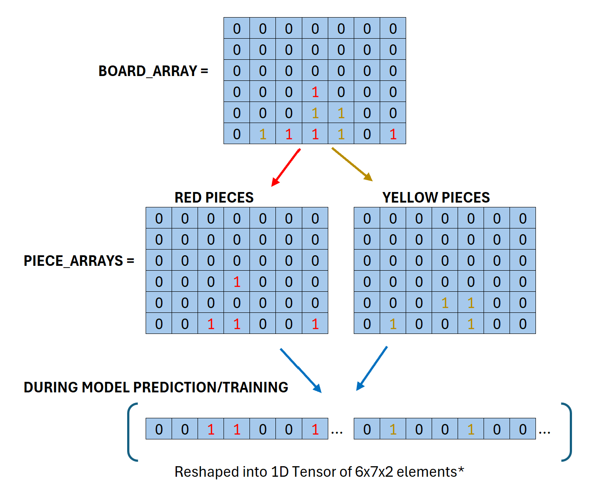

# Connect 4 Reinforcement Learning Agent
This project implements a basic Reinforcement Learning (RL) agent to play the game Connect 4.

## Background: Connect 4
Connect 4 is a board game played between 2 players where each player takes turns placing checkers into a grid of 6 rows and 7 columns. 
The player who places their pieces to connect 4 in a row (horizontally, vertically, or diagonally) wins the game.
This grid can be expanded with a larger board and different connect 'n' requirements, but this implementation restricts itself to the traditional 6x7 connect 4 format.

The remainder of this document will highlight an approach to implementing an RL bot to learn to play Connect 4 based on Deep [Q-learning](https://en.wikipedia.org/wiki/Q-learning). 

The approach is outlined as follows:
- Building the game (with Python <> Pygame)
    - Pygame basics
    - Game mechanics implementations in Python
- Reinforcement Learning (RL)
    - RL Basics & Components
    - Deep Q-Learning
    - Our Training Implementation
- Simulation Results
    - Results vs. Random Bot, RL Bot, & Self-play
    - Future Improvements

## Building the Game: Python, Pygame
The Connect 4 game is implemented from scratch using the [Pygame library](https://www.pygame.org/) in Python. 

### Pygame Implementation
In a nutshell, Pygame initiates a game window to render objects/images of the game and tracks events like keyboard key or mouse button presses.
Depending on what we want our game to do, we search for events in the main game loop and carry out functionality like placing pieces in a particular column in Connect 4.
For example, an event will be recorded when the mouse is moved across the game window, as well as the mouse's coordinate position (i.e., x,y values).
If a mouse button press is recorded at some coordinate, we can place a piece by calculating which column of the Connect 4 board was pressed based on the x value of the mouse press location. 

Below is pseudocode for the main loop:

```python
while True: # start the game
    for event in pygame.event.get(): # for the current frame, check all events that occur
        if event.type==pygame.QUIT:
            pygame.quit()
        if event.type==pygame.MOUSEBUTTONDOWN: # for human players
            Calculate column on board based on mouse press coordinates
            if column chosen is in bounds:
                - Place the piece, update arrays needed
                - Check connect 4 win condition 

        render_pieces() # render individual red and yellow checker pieces based
        render_board() # render the board on top of pieces
        render_scores()
        CLOCK.tick(60)
        
        if Game is done: # draw, or one side wins
            End the loop
            Record results
            Refresh the game
```

Pieces are stored as class objects and the piece images themselves (as well as the board image) are made in [Canva](https://www.canva.com/) and transferred to [Gimp](https://www.gimp.org/) to convert them to transparent images (using the 'Convert to Alpha' functionality). 

These pieces are rendered as follows: 

```python
# PIECES ----------
from dataclasses import dataclass

@dataclass
class Piece:
    turn: int
    coords: tuple

... 

PLACED_PIECES = []
PLACED_PIECES.append(placed_piece) # whenever a move is made to place a piece

PIECE_IMGS = {
    -1: pygame.image.load('imgs/red_piece.png'),
    1: pygame.image.load('imgs/yellow_piece.png')
}

def render_pieces(): # called at every tick of the clock
    for piece in PLACED_PIECES:
        DISPLAY.blit(PIECE_IMGS[piece.turn], piece.coords)
```

The board is represented as a 2D `np.array()` variable `BOARD_ARRAY` containing `0`, and when a piece is placed, the array is filled in with `1` at the corresponding coordinate. 
In addition, 2 separate arrays are maintained which represent only the pieces for the red and yellow players.
These arrays can be summed to equal the `BOARD_ARRAY`, and will be used as 'state' matrices for the RL neural network since an RL bot would need to know which pieces are friendly vs. enemy pieces to make good decisions.

```python
# BOARD ----------
BOARD_DIM = (7, 6) #columns, rows
BOARD_ARRAY = np.zeros(tuple(reversed(BOARD_DIM)))
PIECE_ARRAYS = {
    -1: np.zeros_like(BOARD_ARRAY), 
    1: np.zeros_like(BOARD_ARRAY)
}

BOARD_IMG = pygame.image.load('imgs/board.png')

def render_board(): # called at every tick of the clock
    DISPLAY.blit(BOARD_IMG, (0 ,0))

```

The logic to place pieces and update BOARD/PIECE arrays is as follows:
```python
def place_piece(turn, col):
    - Check if move is legal # i.e., that selected column is not already full
        - For RL bot purposes, choosing an illegal move results in a loss
    - If there are no pieces in the selected col: place piece at maximum index (last row)
    - If there are already pieces in the col: place piece at the np.argmax()-1 of the column
    - Update the PIECE_ARRAYS[current_player] and BOARD_ARRAY with 1 at the coordinate
    - Check if Connect 4 win condition is met, OR if the board is full of pieces (check_connect_4_piece)
        - If connect_4: return 'win' for the current side
        - If not connect_4 and board_full: return 'draw'
        - Else: return None # continue the game
```

In order to check for the Connect 4 win condition, the function `check_connect_4_piece()` crawls in all directions of a newly-placed piece to check if neighbouring pieces link up to 4 or more.
There are 4 directions to check in total which correspond to 1D vectors.
At the current coordinate of the newly-placed piece, we can just add and subtract the vectors for each direction to get the coordinate of the slots to check next:
- Horizontal -> [0, 1] 
- Vertical -> [1, 0]
- Diagonal 1 -> [1, 1]
- Diagonal 2 -> [-1, 1]

Let's say we have a newly-placed piece at coordinate [3, 3]. To check for connect 4:
- First check the 'horizontal' direction by adding the vector [0, 1] to our current coordinates to get the right slot, and subtract the vector to get the left slot (therefore, we check the right side [3,4] and the left side [3, 2])
- If the left slot doesn't contain a friendly piece to continue the chain, then stop searching the left side for this direction (and similarly for the right side search).
- If the left slot does contain a friendly piece, then continue the search by subtracting the vector [0, 1] (therefore, we now check [3, 1]) (and similarly, add the vector for the right side search)
- Continue this search until both left and right sides come across dead ends. 
- Once both sides left and right have come across dead ends (either non-friendly pieces or out of bounds), then stop the search in the horizontal direction, and sum up the number of friendly pieces we found in the search.
- Repeat this search for the other 3 directions vertical, diagonal 1, and diagonal 2.
- After all searches are done, check if any of the sums found are greater than or equal to 4. 

The implementation is as follows:
```python
def check_connect_4_piece(connect_n: int, piece_array: np.array, placed_coord) -> bool:
    """Determines if the placement of a new piece at @placed_coord results in connect 4."""
    crawl_axes = np.array([
        [1, 0], # vertical
        [0, 1], # horizontal
        [1, 1],
        [-1, 1],
    ])
    def coord_is_inbounds(coord, board) -> bool:
        return (0 <= coord[0] < board.shape[0]) and (0 <= coord[1] < board.shape[1])
    
    axes_sums = []
    for crawl_dir in crawl_axes:
        sum_dir = 1
        search_sides = [True, True] # left, right

        for n in range(connect_n-1):
            left = placed_coord - (n+1)*crawl_dir
            right = placed_coord + (n+1)*crawl_dir
            for i, side in enumerate([left, right]):
                if search_sides[i] and coord_is_inbounds(side, piece_array):
                    if piece_array[tuple(side)]==0:
                        search_sides[i] = False # cut the chain
                    else:
                        sum_dir += 1
                else:
                    search_sides[i] = False
            if not any(search_sides):
                break 
        axes_sums.append(sum_dir)
    
    return any([s>=connect_n for s in axes_sums])
```

For initial testing purposes, we instantiate a `Bot` class that selects a random column to place a piece from the available columns on the board. 

The implementation is as follows:
```python
# Bot Class
class Player:
    def __init__(self, name: str, turn: int) -> None:
        self.name = name
        self.turn = turn # -1|1

    def move(self, board_arr) -> int:
        raise NotImplementedError("Implemented by child class.")


class Bot(Player):
    def __init__(self, name: str, turn: int) -> None:
        super().__init__(name, turn)

    def move(self, board_arr) -> int:
        available_cols = board_arr.sum(axis=0) < board_arr.shape[0]
        available_cols = [c for c, i in zip(list(range(board_arr.shape[1])), available_cols) if i]
        col = random.choice(available_cols)
        return col

# In the main Pygame loop
while True:
    ...
    ...
    if current_player is Bot:
        selected_column = Bot.move(current_state)
        place_piece(selected_column)
```

## Reinforcement Learning (RL)
There are 3 primary classes of machine learning which include the following:
> ### Supervised learning:
> Learning from a dataset that is labelled, and the goal in training is to predict the label/target. 
> A target/label is supplied for each data instance to serve as the 'ground truth' and models aim to minimize the error of their predictions against the ground truth.
> 
> For example, input data can be information on houses like `neighbourhood, square footage, # of bedrooms/bathrooms`, and the label/target to predict can be `house price`.

> ### Unsupervised learning:
> Learning from unlabelled data to find meaningful structure. 
> For example, input data can be `retail store sales data`, where every sample is a customer's basket of purchased items.
> A model can be developed to learn from this data and group customers into `n` number of categories based on the types and frequencies of items they purchase.
> Such a model might organically cluster customers into groups like `high income/low income`, `parent/non-parent` without the need for the ML developer to create or search for such clusters.

> ### Reinforcement learning:
> Learning the optimal actions to take in an environment where states and rewards for each action are observed by a model/agent.
> An agent interacts with an environment and takes action which reap rewards, and the agent learns based on past experience to make better decisions over time. 
> An example might be for an agent to be trained in playing board games like Connect 4 or Chess, where the state of the board is relayed to an agent which estimates the values of the next possible actions to take.
> From these estimates, the agent makes a move on the board to gain a reward and update the board state. 

### RL Components
Reinforcement learning involves several components that are defined uniquely for each RL problem.
In simple terms, a problem can be defined as an RL problem if there is some notion of `state` in the environment that can be passed to an `agent`, and the `agent` must take an `action` by following a `policy`.
This produces a `reward` and, consequently, a new `state` as a result. 
The learning that occurs is when an agent updates it's estimation of how 'valuable' each move is in each possible state based on the rewards that it receives taking those actions.
The premise of RL is to learn how to map states to the appropriate actions to take in order to maximize some numerical reward signal.

#### State
State is a representation of the current environment for which the agent must make a decision in.
In our case, state is represented by the `BOARD_ARRAY` or `PIECE_ARRAYS`, which are 2D arrays denoting where certain pieces are on the Connect 4 board.



Prior to feeding the state into our model, we simply reshape the 2 piece arrays into a 1D tensor with 6x7x2 elements. 
We use these state arrays as follows for model prediction:
```python
class RLBot(Player):
    ...
    
    def get_state_array(self, piece_arrays: Dict):
        state_array = np.stack([piece_arrays[self.turn], piece_arrays[-self.turn]])
        return state_array

    def process_state(self, curr_state: np.array):
        num_cells = curr_state[0].shape[0]*curr_state[0].shape[1]
        curr_state = curr_state.reshape(1, num_cells*2)
        if isinstance(self.activation, torch.nn.ReLU):
            curr_state += np.random.rand(1, num_cells*2)/10.0

        state = torch.from_numpy(curr_state).float().to(device)
        return state

    def move(self, piece_arrays: Dict) -> int:
        curr_state = self.get_state_array(piece_arrays)
        state = self.process_st nuj nujate(curr_state)
        q_vals = self.model(state)

        # get best predicted action
        action_ = np.argmax(q_vals_)
        return action_
    ...
```

#### Agent
An agent is simply the mechanism that interacts with an environment to receive states, rewards, and next states for the purpose of learning.
In our implementation, our `RLBot` class effectively acts as our agent which encapsulates our neural network model (Value function), move generation logic, and training loop (which enables the 'learning' to occur in RL).
This class is also the object to be called by the game environment when it is the RLBot's turn to make a move on the board, thus, acting as our agent in this problem.

#### Action
The available actions we can take in Connect 4 are simple since the agent only has 7 columns available to decide where to place a new piece when it's the agent's turn.
In our implementation, our agent selects a column between 0 and 6 to denote the index of the column to place a new piece.

#### Policy
A policy defines the agent' behaviour at a given time/state.
It essentially represents a mapping of states to the actions an agent should take.
For example, for a self-driving car, a simplistic policy might be to take the action `accelerate` if the road condition is `clear` of obstacles (though this would not be a very good or safe static policy to set).

The policy we select for our agent is to generate the estimated values of taking each action (i.e., assess columns 0 to 6), and take the action with the highest estimated value, but take a random action `epsilon` percent of the time. 
We set the `epsilon` rate to produce random actions in order to invoke exploration in the RL agent. 
This is because we need to incentivize the agent to explore novel moves in different situations to ensure comprehensive learning of the game, as the random initialization of parameter weights in neural networks can cause learning algorithms to get stuck in local minima. 

```python
class RLBot(Player):
    def __init__(self, name: str, turn: int) -> None:
        ...
        self.epsilon = 0.2
        ...

    def move(self, piece_arrays: Dict) -> int:
        ...
        # feed the state vector to our model to predict the estimated value of each action
        q_vals = self.model(state) 

        # select best predicted action (1-epsilon) % of the time
        if random.random() < self.epsilon: # exploration
            action_ = np.random.randint(0, 7)
        else: # exploitation
            action_ = np.argmax(q_vals)
        return action_
    ...
```

#### Value Function
In order to estimate the values of each action in each state to guide the agent's policy, a value function must be used.
In this project, we use Deep RL by incorporating a neural network as the value function estimator.
We feed the neural network with the state representation vector and receive an output vector with 7 elements, each corresponding to a column on the Connect 4 board.
We treat the values of this output vector as the estimated values for each of the actions to take in the given position, and our training for the neural network will aim to minimize the loss between the model's predicted values and the actual observed rewards for each action.

Below is the setup of our neural network model:


The neural network implementation is shown below:
```python
class RLBot(Player):
    def __init__(self, name: str, turn: int) -> None:
        super().__init__(name, turn)

        self.activation = torch.nn.ReLU
        self.model = self.initialize_model()
        self.loss_fn = torch.nn.MSELoss()
        self.lr = 1e-3
        self.optimizer = torch.optim.Adam(self.model.parameters(), lr=self.lr) 
        self.gamma = 0.9
        self.epsilon = 0.2
        ...

    def initialize_model(self):
        input_n = 84
        hidden_n = 150
        hidden_n_2 = 100
        output_n = 7
        model = torch.nn.Sequential(
            torch.nn.Linear(input_n, hidden_n),
            self.activation(),
            torch.nn.Linear(hidden_n, hidden_n_2),
            self.activation(),
            torch.nn.Linear(hidden_n_2, output_n),
        )
        ...
        return model
```

#### Reward
Rewards are numerical signals to teach an agent which actions are favorable and which are not.
These can be defined in a number of ways and can also be treated as a hyperparameter for tuning.
For example, if we want an agent to perceive certain losses or situations very negatively, then we may opt to give a very large negative reward.
For a board game that reaches episodic conclusions (i.e., the game ends with a winner or a draw), we can define rewards based on whether the agent made actions that resulted in a win, loss, or draw.
During the game, if the game result has not yet been decided, then rewards can be defined as 0 for every move, however, some games can be set up to give negative rewards (punishment) to agents for every move they make which might motivate agents to learn 'quicker' methods of reaching episodic conclusions.

Our reward system is setup as follows:
```python
class RLBot(Player):
    def __init__(self, name: str, turn: int) -> None:
        ...
        self.reward_vals = {
            'draw': 5,
            'win': 10,
            'loss': -10,
            'move': 0,
        }
```

#### Deep Q-Learning: How does our model learn?
Deep RL requires us to update the parameters of our value function (neural network) in order to learn better estimations of the values of actions based on the states that are fed in to the network.
In order to do this, we use Deep Q-learning. 
[Q-learning](https://en.wikipedia.org/wiki/Q-learning) holds that the value of taking an action `a` in a given state `s` should be equal to the the reward `r` received by taking `a` in `s`, plus the value of the highest next action `a'` in the next state `s'`.
This is because when we take action `a`, this will lead to the inevitable new state `s'` where we will make another action `a'` that should represent the best action at that state.

The formula for Q-learning is shown below, where &gamma; represents a discount factor that discounts the importance of future rewards: 


Conceptually, a &gamma; of 0 would cause the right side of the equation to equal 0, meaning that the agent would only value the current action it's taken by the immediate reward that it receives, causing it to be 'shortsighted' in its optimization.
Ideally, we would like RL agents to take actions that lead to higher value on the bigger scale as opposed to just the current move. 

Our implementation of Q-learning in our training loop is as follows:
```python
class RLBot(Player):
    def __init__(self, name: str, turn: int) -> None:
        self.loss_fn = torch.nn.MSELoss()
        self.optimizer = torch.optim.Adam(self.model.parameters(), lr=self.lr) 
        self.lr = 1e-3
        self.gamma = 0.9
        self.epsilon = 0.2
        ...

    def train(self, new_piece_arrays, result):
        new_state = self.get_state_array(new_piece_arrays) #new state s' after we've made a move
        new_state = self.process_state(new_state)
        ...
        reward = self.get_reward(result)
        
        # get estimated Q values of new state to update last state's Q values
        with torch.no_grad():
            new_q = self.model(new_state)
        max_q = torch.max(new_q) # get value of next best action

        # Q-learning target value
        # If game ends (result is not None), then there is no next state, just take reward)
        Y = reward if result is not None else reward + (self.gamma*max_q)
        X = current_state_q_val # the q-value of the action we just took
        loss = self.loss_fn(X, Y) # calculate how far off our estimate was
        self.optimizer.zero_grad() # reset gradients
        loss.backward() # perform back propagation
        ...
        self.optimizer.step() # update network parameters
        ...
```

In a nutshell, the training loop gathers the estimated future Q-value denoted as `Y` and we compare it against our original estimate of the Q-value denoted as `X` using the loss function.
The loss function is basically a fancy function that compares 2 values and outputs how far off they are from eachother, typically outputting larger values if our estimate of `X` was way off from the future value it 'should've' been closer to as `Y`. 

Let's say our loss function outputs a large value (which means that our network was way off in estimating the value of the action it just took in the current state).
That means, theoretically, we have a lot of learning to do, or a big 'adjustment' in the network parameters to make. 
Therefore, after calculating this loss, we perform [back propagation](https://en.wikipedia.org/wiki/Backpropagation) which is essentially a way to take the loss value (i.e., the amount of error we made for this particular instance) and attribute it to the different nodes in our neural network. 
Basically, we're trying to place 'blame' on which node parameters were the most incorrect using differentiation (cool maths that I won't get into in this project). 

Once we can attribute where the error should be sprinkled across the different nodes in our network, then we can update the parameters of our network so that for future instances, our model will be just slightly better (i.e., make slightly smaller error/loss) for future predictions. 